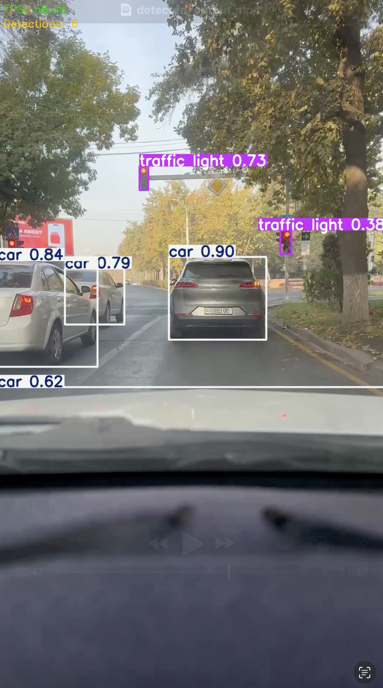

# 🚗 AssistantDrive

**Real-time AI-powered driving assistance for new drivers**

[](https://github.com/Sanjarbek17/AssistantDrive)
[](LICENSE)
[](https://github.com/Sanjarbek17/AssistantDrive)

## 📖 Overview

AssistantDrive is an innovative AI-powered driving assistance system designed to reduce road stress and errors for new drivers. The system uses your smartphone camera (or vehicle cameras) to analyze real-time road conditions and provides instant voice alerts and recommendations through text-to-speech technology.

<div align="center">
  
  <p><em>Real-time object detection with confidence scores for cars, traffic lights, and road signs</em></p>
</div>

### 🎯 Key Features

- **Real-time Video Analysis**: Stream video from your phone camera to our AI backend
- **Lane Departure Detection**: Get alerted when you drift from your lane
- **Traffic Sign Recognition**: Automatic detection of speed limits, stop signs, and pedestrian crossings
- **Proximity Alerts**: Warning for vehicles approaching too close
- **Voice Guidance**: Multi-language TTS support (Uzbek, Russian, English)
- **Route Assistance**: Proactive turn-by-turn navigation hints

<div align="center">
  
  <p><em>Clean and intuitive home interface showing system status and daily detection overview</em></p>
</div>

## 🚀 Quick Start

### Prerequisites

- iOS 14+ or Android 8+ device
- Stable internet connection (1-2 Mbps recommended)
- Phone mount for dashboard/windshield

### Installation

```bash
# Clone the repository
git clone https://github.com/Sanjarbek17/AssistantDrive.git
cd AssistantDrive

# Install dependencies (coming soon)
# Follow platform-specific setup guides
```

## 🏗️ System Architecture

```
📱 Mobile App (Flutter) ──► 🌐 Backend API ──► 🤖 AI Analysis
     │                         │                    │
     ├─ Video Streaming        ├─ Event Processing  ├─ Lane Detection
     ├─ GPS Location           ├─ JSON Response     ├─ Sign Recognition
     └─ TTS Alerts            └─ CDN Storage       └─ Proximity Analysis
```

## 🎯 Target Audience

- **New Drivers**: 0-2 years of driving experience
- **Urban Drivers**: Need assistance in complex city traffic
- **Driving Schools**: Training and demonstration tool
- **Safety-Conscious Drivers**: Want additional road safety features

## 📊 Event Detection

The system detects and responds to various driving scenarios:

| Event Type | Description | Severity | Response Time |
|------------|-------------|----------|---------------|
| Lane Departure | Drifting from lane markers | Medium | < 1.5s |
| Wrong Turn | Incorrect route direction | High | < 1s |
| Speed Limit | Speed limit sign detection | Low | Real-time |
| Pedestrian Alert | Pedestrian in crosswalk | High | < 1s |
| Proximity Warning | Too close to vehicle ahead | Medium | < 1.5s |

<div align="center">
  
  <p><em>Comprehensive detection history with accuracy metrics and detailed road signs analysis</em></p>
</div>

## 🔧 Technical Specifications

### Performance Targets
- **Accuracy**: ≥ 85% for critical event detection
- **Latency**: ≤ 1.5 seconds end-to-end response
- **Uptime**: 99% system availability
- **Bandwidth**: Optimized for mobile networks (1-2 Mbps)

### Supported Formats
- **Video**: 720p @ 15-30fps
- **Protocols**: WebRTC, RTMP/HTTP-FLV
- **Audio**: TTS in multiple languages
- **Data**: JSON event responses

## 📱 API Response Example

```json
{
  "timestamp": "2025-10-17T11:00:12Z",
  "events": [
    {
      "event_id": "evt_001",
      "event_type": "lane_departure",
      "confidence": 0.92,
      "severity": "medium",
      "suggested_action": "Chapga qayting va chiziqqa moslaning",
      "clip_url": "https://cdn.example.com/clips/evt_001.mp4"
    },
    {
      "event_id": "evt_002", 
      "event_type": "speed_limit_detected",
      "confidence": 0.88,
      "severity": "low",
      "detected_value_kmh": 60,
      "suggested_action": "Tezlikni 60 km/soatga moslang"
    }
  ],
  "location": {
    "latitude": 41.311081, 
    "longitude": 69.240562, 
    "accuracy": 5
  }
}
```

## 🗣️ Voice Alerts (Sample)

### Uzbek Language
- **Critical**: "Diqqat! To'xtang! Xavf bor!"
- **Warning**: "Siz yo'l chizig'idan chiqib ketmoqdasiz. Markazga qayting."
- **Guidance**: "Keyingi burilish: chap tomonda. 150 metrda buriling."

### Multilingual Support
- 🇺🇿 **Uzbek**: Native language support
- 🇷🇺 **Russian**: Regional language support  
- 🇬🇧 **English**: International standard

## 🛣️ Project Roadmap

### Phase 0: Concept & PRD ✅
- [x] Requirements documentation
- [x] System architecture design
- [x] Technical specifications

### Phase 1: MVP Development (8-12 weeks)
- [ ] Basic video streaming infrastructure
- [ ] Core lane detection algorithm
- [ ] Traffic sign recognition
- [ ] TTS alert system
- [ ] Mobile app foundation

### Phase 2: Beta Testing (12 weeks)
- [ ] Real-world testing program
- [ ] Model optimization and tuning
- [ ] Rear camera support
- [ ] User feedback integration
- [ ] Performance optimization

### Phase 3: Production Release (8-12 weeks)
- [ ] Scalable infrastructure deployment
- [ ] Security certifications
- [ ] Marketing and user acquisition
- [ ] Advanced analytics dashboard

## 🔒 Privacy & Security

- **Data Encryption**: AES-256 for stored data, TLS 1.3 for transmission
- **Privacy Compliance**: GDPR and local regulation compliance
- **Data Retention**: Configurable 7-30 day video clip storage
- **User Control**: Opt-out options and data anonymization

## 📈 Success Metrics

- **Detection Accuracy**: ≥ 85% for critical events
- **User Satisfaction**: ≥ 70% NPS score in beta testing
- **Response Time**: ≤ 1.5 seconds for alerts
- **System Reliability**: 99% uptime target

<div align="center">
  
  <p><em>Personal driving profile with detailed statistics and quick access to key features</em></p>
</div>

## 🤝 Contributing

We welcome contributions from the community! Please read our [Contributing Guidelines](CONTRIBUTING.md) before submitting pull requests.

### Development Setup
```bash
# Frontend (Flutter)
flutter pub get
flutter run

# Backend (Node.js/Python)
npm install  # or pip install -r requirements.txt
npm start    # or python app.py
```

## 📄 License

This project is licensed under the MIT License - see the [LICENSE](LICENSE) file for details.

## 📞 Contact & Support

- **Project Lead**: [Sanjarbek17](https://github.com/Sanjarbek17)
- **Email**: [Contact Email]
- **Issues**: [GitHub Issues](https://github.com/Sanjarbek17/AssistantDrive/issues)
- **Discussions**: [GitHub Discussions](https://github.com/Sanjarbek17/AssistantDrive/discussions)

## 🙏 Acknowledgments

- AI/ML research community for computer vision advances
- Open source contributors and maintainers
- Beta testers and early adopters
- Driving safety organizations and advocates

---

⚠️ **Important**: This system is designed to assist drivers, not replace careful driving practices. Always maintain focus on the road and follow traffic laws.

📊 **Status**: Currently in active development. Star ⭐ this repository to stay updated on our progress!